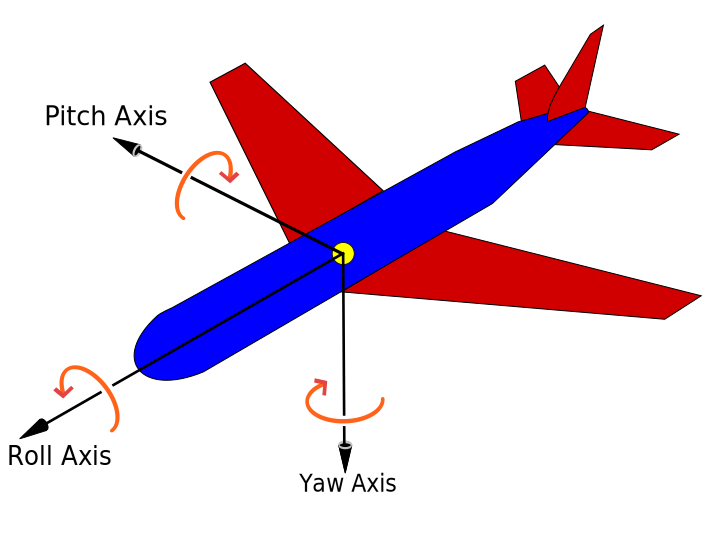

# Geomancy

> Linear is nice, but slow. Those are naughty, but a bit faster.

* All data types are monomorphic, unpacked and specialized.
* `Mat4` and `Vec4` are `ByteArray#`.
* `Mat4`x`Mat4` and `Mat4`x`Vec4` is done with SIMD.

## The Numbers

Storing a list of 1000 transformations (e.g. rendering instance data):

```
benchmarking 4x4 poke/1000/geomancy
time                 11.76 μs   (11.66 μs .. 11.92 μs)
                     0.999 R²   (0.998 R² .. 1.000 R²)
mean                 11.75 μs   (11.69 μs .. 11.86 μs)
std dev              283.4 ns   (199.0 ns .. 399.0 ns)
variance introduced by outliers: 26% (moderately inflated)
```

If you're willing to adjust your shaders, it's only 2.4 times slower.

```
benchmarking 4x4 poke/1000/linear
time                 28.29 μs   (28.21 μs .. 28.38 μs)
                     1.000 R²   (1.000 R² .. 1.000 R²)
mean                 28.40 μs   (28.34 μs .. 28.50 μs)
std dev              267.4 ns   (145.5 ns .. 419.9 ns)
```

Keeping your shaders straight make the affair 6.1x slower.

```
benchmarking 4x4 poke/1000/linear/T
time                 73.70 μs   (73.06 μs .. 74.49 μs)
                     1.000 R²   (0.999 R² .. 1.000 R²)
mean                 72.77 μs   (72.50 μs .. 73.22 μs)
std dev              1.129 μs   (793.5 ns .. 1.580 μs)
```

Folding down a `gloss`-style scene graph is where it is all started:

```
benchmarking 4x4 multiply/1000/geomancy
time                 20.79 μs   (20.77 μs .. 20.83 μs)
                     1.000 R²   (1.000 R² .. 1.000 R²)
mean                 20.80 μs   (20.78 μs .. 20.83 μs)
std dev              76.71 ns   (60.01 ns .. 99.06 ns)

benchmarking 4x4 multiply/1000/linear
time                 173.9 μs   (173.6 μs .. 174.4 μs)
                     1.000 R²   (1.000 R² .. 1.000 R²)
mean                 173.5 μs   (173.2 μs .. 174.4 μs)
std dev              1.733 μs   (727.8 ns .. 3.422 μs)
```

Add that time to the poking that'll follow.

Sure, it is in the lower microseconds range, but this budget can be used elsewhere.

## Conventions

### Matrix layout

Transforms produced, composed, and applied to mimic the GLSL order (col-major):

- `vec4 vPosOut = P * V * M * vPosIn;`
- `vPosOut = (p <> v <> m) !* vPosIn`

This way you don't have to transpose your transforms or fiddle with layout annotations.

### Projections / Views

`Geomancy.Vulkan.Projection` is using the "reverse-depth" trick that remaps the vulkan default `[0; 1]` range to `[1; 0]`.
This grants extra precision with one less parameter to specify (you only need "near" now), but makes handedness reasoning tricky.
The default depth range the coordinate is left-handed (+X right, +Y down, +Z forward).
But after reversing the depth it has to be paired with a right-handed view function like `Geomancy.Vulkan.View.lookAtRH`.

The intended up vector is still `vec3 0 (-1) 0` -- +Y down.
Silly as it sounds, this matches the XY plane of the window with XY plane in front of a "first person" camera.

### Rotations

Axis rotations (using `rotateQ`) will appear clockwise when looking along the axis.

Angle rotations follow Tait-Bryan angles (heading/elevation/bank or yaw/pitch/roll) in the y-x-z frame.
- `rotateZ (time * rate)` will follow the clock hands in 2D scenes and roll in 3D.
- `rotateX` will follow the sun from sunrise to sunset, increasing elevation / pitching UP.
- `rotateY` will turn you right, increasing yaw/heading eastwards.

Using `Geomancy.Quaternion.intrinsic roll pitch yaw` will make a rotation from the 3 angles in one go.
You can use it to `rotate` a point directly (e.g `vec3 0 0 1` to get a direction vector from Quaternion) or commit to a matrix using `Transform.rotateQ`.



You're of course free to define your own transforms, just copy the modules and tune to your liking.
Just make sure that you use matching row/column constructors and the math layer will do the rest, fast.

## GLSL-like functions

To further facilitate conversion between the host and shader code `Geomancy.Gl.Funs` provides common functions like `glFract` and `smoothstep`.
